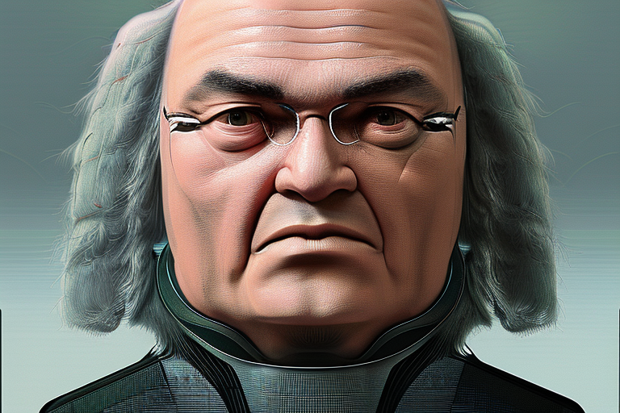

# Cantable Diffuguesion

_Bach chorale generation and harmonization_

## Usage

You can use Cantable Diffuguesion to generate Bach chorales unconditionally, or harmonize melodies or parts of melodies.

For harmonization we use [tinyNotation](https://web.mit.edu/music21/doc/moduleReference/moduleTinyNotation.html), with a few modifications:
* The `?` symbol followed by a duration denotes a section that the model should in-paint, e.g. `?2` will in-paint a half note duration.
* The `?*` symbol will in-paint everything between a defined beginning and an end, e.g. `c2 ?* B4 c2` will start the piece with `c2`, then generate notes for the specified duration, and finally the melody will end with `B4 c2`.
* Optional bars `|` are ignored and can be used to make the melody notation more pleasing.

## Training

Cantable Diffuguesion is a diffusion model trained to generate Bach chorales. Four-part chorales are presented to the network as 4-channel images. As in Stable Diffusion, a U-Net is trained to predict the noise residual.

After training the generative model we add 12 channels to the inputs, with the middle four channels representing a mask, and the last four channels are masked chorales. We mask the four channels individually, as opposed to [Stable Diffusion Inpainting](https://huggingface.co/stabilityai/stable-diffusion-2-inpainting) that use a one-channel mask.

## Dataset

We use all four-part pieces in the [Music21 Bach Chorales corpus](https://web.mit.edu/music21/doc/moduleReference/moduleCorpusChorales.html). 85% are used for training.

## Inspiration

* [Riffusion](https://github.com/riffusion/riffusion)
* [DeepBach](https://arxiv.org/abs/1612.01010)
* [Dreambooth Inpainting](https://github.com/huggingface/diffusers/blob/50b6513531da7e258204871a9c675a56875d9e69/examples/research_projects/dreambooth_inpaint/README.md)
